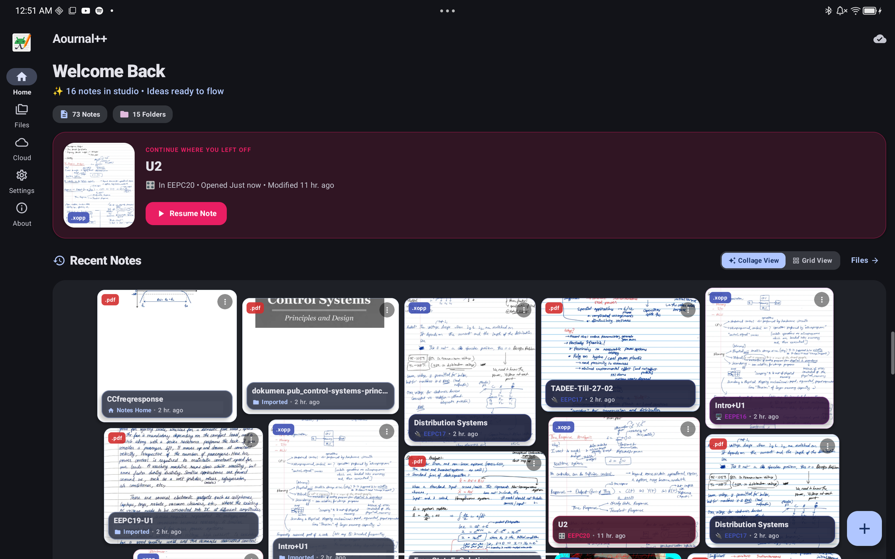
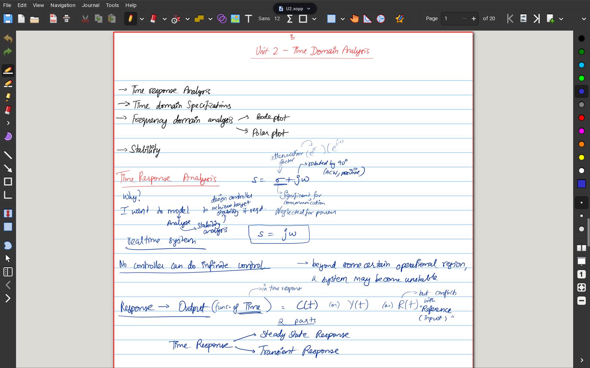
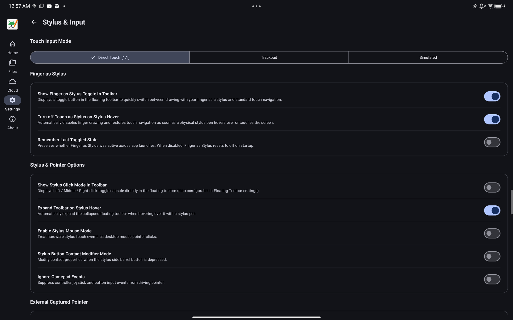
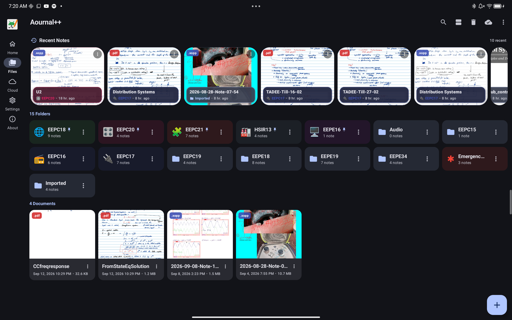
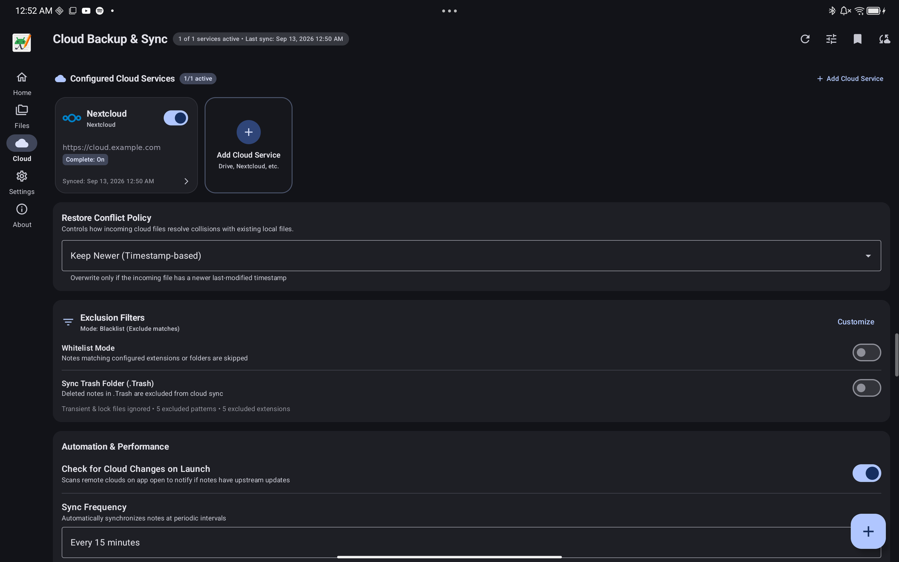
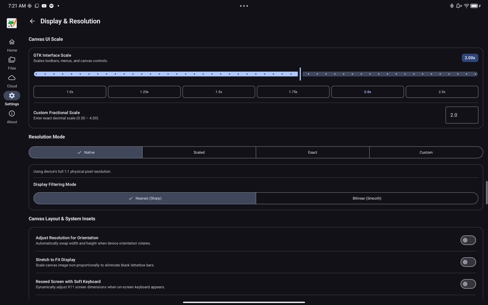

<a id="readme-top"></a>

<!-- PROJECT SHIELDS -->
[![Forks][forks-shield]][forks-url]
[![Stargazers][stars-shield]][stars-url]
[![Issues][issues-shield]][issues-url]
[![project_license][license-shield]][license-url]
[![CI Build][ci-shield]][ci-url]

<!-- PROJECT LOGO -->
<br />
<div align="center">
  <a href="https://github.com/ilamparithi-in/aournalpp">
    
  </a>

<h3 align="center">Aournal++</h3>

  <p align="center">
    A modern Android companion and wrapper for Xournal++, powered by embedded Termux-X11, low-latency stylus hardware routing, and Material You design.
    <br />
    <a href="https://github.com/ilamparithi-in/aournalpp/issues/new?labels=bug&template=bug_report.md">Report Bug</a>
    &middot;
    <a href="https://github.com/ilamparithi-in/aournalpp/issues/new?labels=enhancement&template=feature_request.md">Request Feature</a>
  </p>
</div>

<!-- TABLE OF CONTENTS -->
<details>
  <summary>Table of Contents</summary>
  <ol>
    <li>
      <a href="#about-the-project">About The Project</a>
      <ul>
        <li><a href="#built-with">Built With</a></li>
      </ul>
    </li>
    <li><a href="#features">Features</a></li>
    <li>
      <a href="#getting-started--building">Getting Started & Building</a>
      <ul>
        <li><a href="#prerequisites">Prerequisites</a></li>
        <li><a href="#cloning-the-repo">Cloning the Repo</a></li>
        <li><a href="#building-the-apk">Building the APK</a></li>
      </ul>
    </li>
    <li><a href="#repository-structure">Repository Structure</a></li>
    <li><a href="#important-legal-disclaimer">Important Legal Disclaimer</a></li>
    <li><a href="#discuss">Discuss</a></li>
    <li><a href="#donate">Donate</a></li>
  </ol>
</details>

<!-- ABOUT THE PROJECT -->
## About The Project



If you have ever used [Xournal++](https://xournalpp.github.io/) on the desktop, you already know why it is beloved: limitless PDF annotation, smooth vector inking, LaTeX math typesetting, layers, and no proprietary lock-in. But taking handwritten notes on an Android tablet has always been a frustrating compromise. You are either pushed into subscription-based closed ecosystems or stuck with clunky workarounds that suffer from desktop environment overhead.

I wanted the real thing: upstream Xournal++ running natively on Android, and an interface that actually feels like a modern Android app.

Introducing **Aournal++**!

Aournal++ bundles a fully self-contained Termux-X11 display server and Linux environment inside the APK. No root, no chroot scripts, and no separate Termux installation required. Surrounding the canvas is a native Material 3 Expressive companion app offering a modern Document Hub, one-tap resume, multi-provider cloud sync, emergency and auto-save handling, and more!

### Built With

[![Kotlin][Kotlin.js]][Kotlin-url]
[![Jetpack Compose][Compose.js]][Compose-url]
[![Android][Android.js]][Android-url]
[![Termux-X11][Termux.js]][Termux-url]
[![C++][Cpp.js]][Cpp-url]
[![Material 3][Material3.js]][Material3-url]
[![Gradle][Gradle.js]][Gradle-url]

<p align="right">(<a href="#readme-top">back to top</a>)</p>

<!-- FEATURES -->
## Features

### 🎨 Modern Material 3 Document Hub
Step into a fluid, gesture-friendly hub that presents your notes the way you want to see them:
- **Collage & Grid Views**: Interactive visual previews of your recent documents, complete with file type badges and modification history.
- **Instant Session Resume**: Jump right back into your last opened notebook with a single tap.
- **Smart Document Actions**: Create blank notes from custom naming patterns, import PDFs directly, or browse folder hierarchies seamlessly.

---

### ✍️ True Desktop-Class Xournal++ Canvas

- Full support for multi-layer drawings, PDF annotations, shape recognition, and custom toolbars.
- Custom canvas backdrops, GTK theme selection (Adwaita Light / Dark), and configurable UI scaling.
- Use your finger as a stylus to draw on the canvas (this is not possible with Termux-X11!)



---

### 🖊️ Stylus & Hardware Pen Routing
Note-taking lives or dies by stylus latency and ergonomics.
- **Hardware Pen Gestures & Button Actions**: Dedicated mappings for pens like the Lenovo Precision Pen (barrel button single-click, double-click, triple-click, and hold to erase, switch tools, or undo).
- **Finger as Stylus Toggle**: Quickly switch between drawing with your fingers or using them purely for pan/zoom navigation, with automatic pen detection.



---

### 📁 Visual Folder Management & Note Organization
Keep semesters of lectures, meeting notes, and research papers organized without hassle:
- **Color-Coded Folders**: Assign custom colors and icons to notebook directories for visual recognition.
- **Metadata Tagging**: Custom note badges, format indicators (`.xopp`, `.pdf`), and folder hierarchy navigation.
- **Quick File Operations**: Rename, move, export to PDF, and share notes directly from the hub.



---

### ☁️ Automated Multi-Provider Cloud Sync
Your notes should stay backed up and available across all your machines:
- **Supported Providers**: Sync with Nextcloud, Google Drive, generic WebDAV, FTP, or local storage directories.
- **Smart Conflict Policies**: Keep newer files automatically based on file modification timestamps.
- **Background & Scheduled Sync**: Periodic background syncing (every 15 min, 30 min, hourly, etc.) or immediate one-tap sync.



---

### 🛠️ In-Depth Display & Inset Customization
Fine-tune how Xournal++ fills your tablet display:
- Interactive **Screen Safe Area Insets Editor** to adjust margins around camera cutouts, system navigation bars, and rounded display corners.
- Granular DPI and resolution scaling for crisp toolbar icons on high-density screens.
- Floating toolbar overlay with customizable buttons, auto-collapse, and position pinning.



<p align="right">(<a href="#readme-top">back to top</a>)</p>

<!-- GETTING STARTED -->
## Getting Started & Building

You can build Aournal++ from source or install debug builds directly onto your Android device.

### Prerequisites

Make sure your development machine has the following tools installed:
- **JDK 17** (e.g. OpenJDK 17)
- **Android SDK** (Compile SDK `34`, Min SDK `26`)
- **Android NDK** (`27.0.12077973`)
- **CMake** (`3.22.1+`)
- **Host Tools**: Python 3, `bison`, `patch`, and `build-essential` (needed for compiling X11 stubs and parsers)

On Debian/Ubuntu:
```bash
sudo apt update
sudo apt install -y openjdk-17-jdk python3 bison patch cmake build-essential
```

### Cloning the Repo

> [!IMPORTANT]
> Aournal++ relies on `termux-x11` and native submodules (`pixman`, `libxkbfile`, `libepoxy`, etc.). **Always clone with `--recurse-submodules`**:

```bash
# Clone repository with all submodules
git clone --recurse-submodules https://github.com/ilamparithi-in/aournalpp.git
cd aournalpp
```

If you already cloned without `--recurse-submodules`, initialize them with:
```bash
git submodule update --init --recursive
```

### Building the APK

Compile the debug APK for ARM64 devices (typical for Android tablets and phones):
```bash
# Assemble ARM64 debug APK
./gradlew assembleArm64Debug

# Or install directly to a connected device via ADB
./gradlew :app:installArm64Debug
```

For x86_64 tablets or emulator testing:
```bash
./gradlew assembleX86_64Debug
```

> [!TIP]
> For advanced build topics, automated patch synchronization, and bootstrap rootfs packaging, check out the comprehensive **[Building Guide](BUILDING.md)**.

<p align="right">(<a href="#readme-top">back to top</a>)</p>


<!-- LICENSING -->
## Licensing

**Aournal++ is an independent, community-driven open-source Android companion and wrapper for Xournal++.**

Aournal++ is distributed under the [GNU General Public License v3.0 (GPL-3.0)](LICENSE). Submodules and third-party components retain their respective open-source licenses.

<p align="right">(<a href="#readme-top">back to top</a>)</p>

<!-- CONTACT & COMMUNITY -->
## Discuss

Have questions, suggestions, or ideas? Join the discussion:

- [GitHub Discussions](https://github.com/ilamparithi-in/aournalpp/discussions)
- [Issue Tracker](https://github.com/ilamparithi-in/aournalpp/issues)

## Donate

Like my work? Consider buying me a Biriyani! 🍛 [Donate](https://pseudosmp.github.io/donate)

<p align="right">(<a href="#readme-top">back to top</a>)</p>

<!-- MARKDOWN LINKS & IMAGES -->
[forks-shield]: https://img.shields.io/github/forks/ilamparithi-in/aournalpp.svg?style=for-the-badge
[forks-url]: https://github.com/ilamparithi-in/aournalpp/network/members
[stars-shield]: https://img.shields.io/github/stars/ilamparithi-in/aournalpp.svg?style=for-the-badge
[stars-url]: https://github.com/ilamparithi-in/aournalpp/stargazers
[issues-shield]: https://img.shields.io/github/issues/ilamparithi-in/aournalpp.svg?style=for-the-badge
[issues-url]: https://github.com/ilamparithi-in/aournalpp/issues
[license-shield]: https://img.shields.io/github/license/ilamparithi-in/aournalpp.svg?style=for-the-badge
[license-url]: https://github.com/ilamparithi-in/aournalpp/blob/main/LICENSE
[ci-shield]: https://img.shields.io/github/actions/workflow/status/ilamparithi-in/aournalpp/debug.yml?style=for-the-badge
[ci-url]: https://github.com/ilamparithi-in/aournalpp/actions/workflows/debug.yml

<!-- Technology Badges -->
[Kotlin.js]: https://img.shields.io/badge/Kotlin-7F52FF?style=for-the-badge&logo=kotlin&logoColor=white
[Kotlin-url]: https://kotlinlang.org/
[Compose.js]: https://img.shields.io/badge/Jetpack%20Compose-4285F4?style=for-the-badge&logo=jetpackcompose&logoColor=white
[Compose-url]: https://developer.android.com/jetpack/compose
[Android.js]: https://img.shields.io/badge/Android-34A853?style=for-the-badge&logo=android&logoColor=white
[Android-url]: https://developer.android.com/
[Termux.js]: https://img.shields.io/badge/Termux--X11-000000?style=for-the-badge&logo=termux&logoColor=white
[Termux-url]: https://github.com/termux/termux-x11
[Cpp.js]: https://img.shields.io/badge/C%2B%2B-00599C?style=for-the-badge&logo=c%2B%2B&logoColor=white
[Cpp-url]: https://isocpp.org/
[Material3.js]: https://img.shields.io/badge/Material%20Design%203-757575?style=for-the-badge&logo=materialdesign&logoColor=white
[Material3-url]: https://m3.material.io/
[Gradle.js]: https://img.shields.io/badge/Gradle-02303A?style=for-the-badge&logo=gradle&logoColor=white
[Gradle-url]: https://gradle.org/
